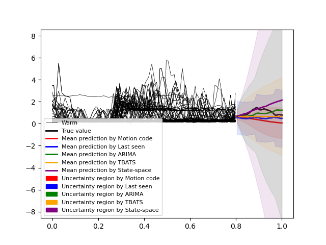
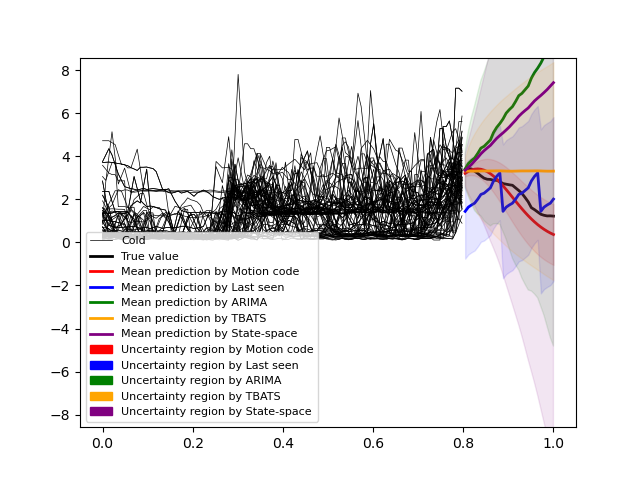
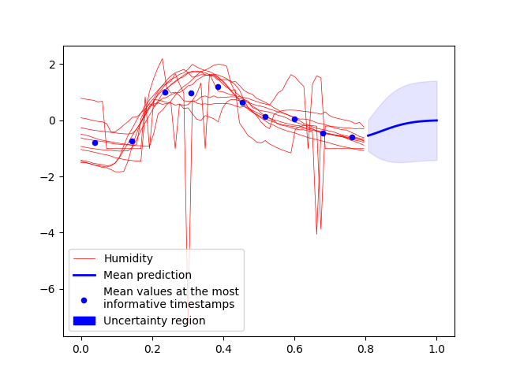
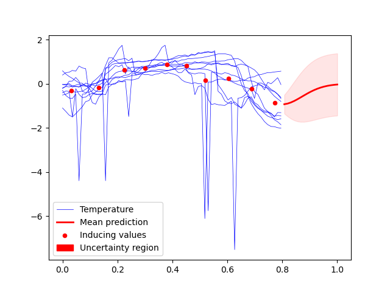

# Motion Code Learning for time series data
Solving time series classification and forecasting is particularly challenging on noisy variable-length time series. We employ variational inference and sparse Gaussian model to develop an integrated framework called **Motion Code** to deal with this type of data.

The method is robust to noise and produces competitive performance against other popular time series classification and forecasting algorithms. Moreover, it can deal with variable length time series and missing data, while many other methods fail to do so. See **Motion Code**'s forecasting prediction with uncertainty on PowerCons data for example:

<figure style="display: flex; flex-direction: column; align-items: center;">
    
    <figcaption>Warm season in PowerCons</figcaption>
</figure>

<figure style="display: flex; flex-direction: column; align-items: center;">

<figcaption>Cold season in PowerCons</figcaption>
</figure>

Finally, **Motion Code** provides an interpretable feature that effectively captures the underlying stochastic process from a collection of noisy time series. See below for the feature captured in **MoteStrain** data:

<figure style="display: flex; flex-direction: column; align-items: center;">

<figcaption>Humidity sensor MoteStrain</figcaption>
</figure>

<figure style="display: flex; flex-direction: column; align-items: center;">

<figcaption>Temperature sensor MoteStrain</figcaption>
</figure>


To build a **Motion Code** model, add the following code:

``` python
from motion_code import MotionCode
model = MotionCode(m=10, Q=1, latent_dim=2, sigma_y=0.1)
```

For training the **Motion Code**, we simply use:

``` python
model.fit(X_train, Y_train, labels_train, model_path)
```

**Motion Code** performs both classification and forecasting. For the classification task, use:
``` python
model.classify_predict(X_test, Y_test)
```
For the forecasting task, use:
``` python
mean, covar = model.forecast_predict(test_time_horizon, label=0)
```
See <strong><code>example.ipynb</code></strong> for more details.