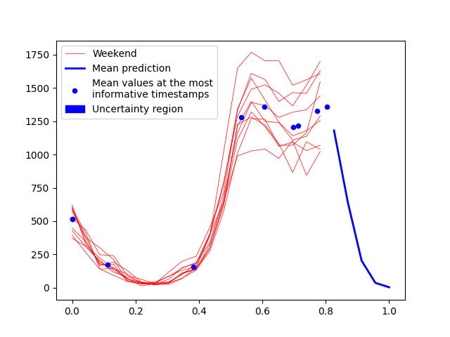
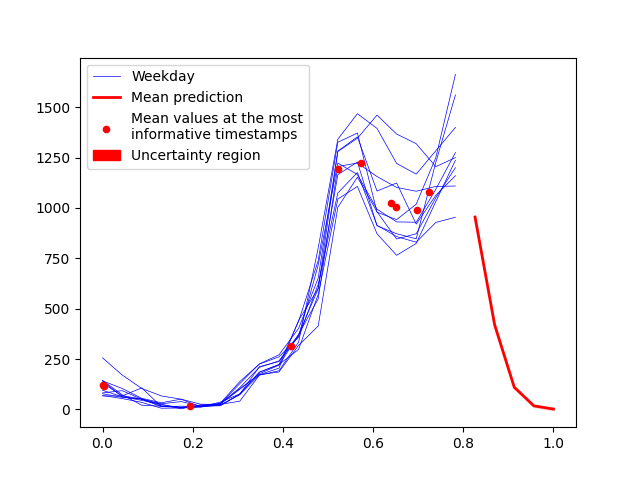

# Motion Code Learning for noisy time series
In this work, we employ variational inference and stochastic process modeling to develop an integrated framework called **Motion Code**. The framework can perform time series forecasting simultaneously with classification across different collections of time series data, while most other current methods only focus on one task at a time. Our *Motion Code* model is particularly robust to noise and produces competitive performance against other popular time series classification and forecasting algorithms. **Motion Code** can also deal with variable-length time series and missing data.

**Motion Code** provides an interpretable feature that effectively captures the core information of the governing dynamics from a collection of noisy time series. See below for the features captured in **MoteStrain** data:

Humidity sensor MoteStrain                 |  Temperature sensor MoteStrain
:-------------------------:|:-------------------------:
  |  

Weekend Chinatown               |  Weekday Chinatown
:-------------------------:|:-------------------------:
  |  

<br></br>
**Motion Code**'s forecasting prediction with uncertainty on PowerCons data:

Warm season in PowerCons                 |  Cold season in PowerCons
:-------------------------:|:-------------------------:
  |  

<br></br>
To build a **Motion Code** model, add the following code:

``` python
from motion_code import MotionCode
model = MotionCode(m=10, Q=1, latent_dim=2, sigma_y=0.1)
```

For training the **Motion Code**, we simply use:

``` python
model.fit(X_train, Y_train, labels_train, model_path)
```

**Motion Code** performs both classification and forecasting. For the classification task, use:
``` python
model.classify_predict(X_test, Y_test)
```
For the forecasting task, use:
``` python
mean, covar = model.forecast_predict(test_time_horizon, label=0)
```
See <strong><code>example.ipynb</code></strong> for more details.
<br></br>

Due to limited Github storage, all noisy data are stored at [Noisy Datasets](https://www.dropbox.com/scl/fo/9fliuzo0d92zawut1gzs3/h?rlkey=89gqigob7q3509gjtcindr9nc&dl=0). Please download the data at the given link to run **Motion Code** notebooks and code.

**Note**: We are submitting our work to a conference. If you want to cite this work, please contact me directly.